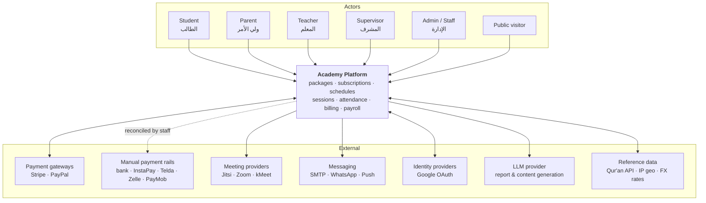
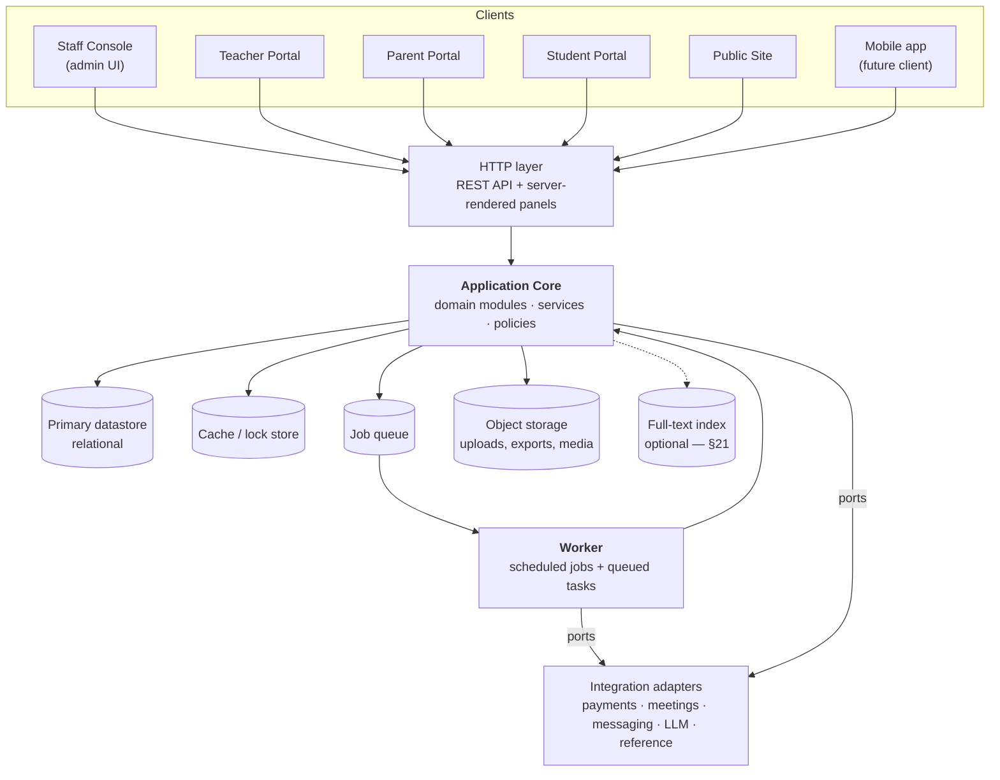
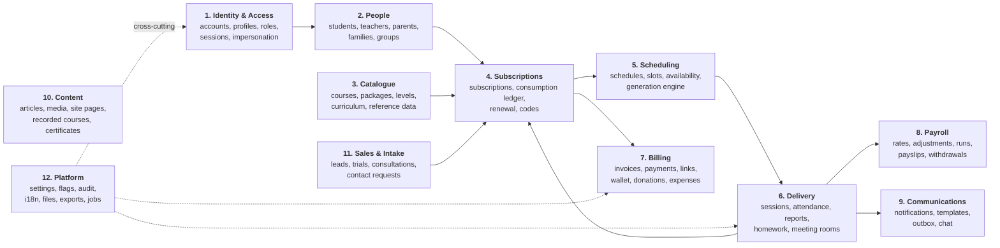
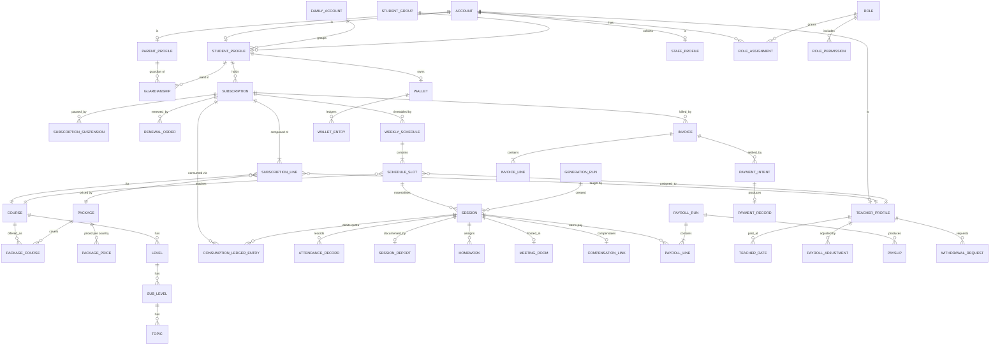

# Phase 2 — System Design / Architecture

**Project:** Online tutoring / Qur'an academy operations platform (TutorHamster-class system)
**Input:** `PHASE_1_SYSTEM_AUDIT.md` — 153 features, 71 entities, 13 workflows, 50 business rules, 17 integrations
**Output of this phase:** the target system's architecture — domain model, module map, engine specifications, state machines, API contracts, and cross-cutting design
**Date:** 2026-09-23

---

## 0. How to read this document

**This phase is deliberately stack-agnostic.** It specifies *what the system is* — bounded contexts, entities, invariants, contracts, state transitions — not which framework, ORM or queue implements it. Any statement that presumes a technology is confined to **Appendix A**, which maps this design onto the already-chosen build stack (Django + a customised admin) and is explicitly non-normative.

**Notation and conventions**

| Convention | Meaning |
|---|---|
| `FEAT-ID →` | Traces a design element back to a Phase 1 feature ID. Full matrix in §20. |
| **Label (التسمية)** | English name with the observed Arabic label preserved, per the documentation standard. |
| `PK` / `FK` / `UQ` | Primary key / foreign key / unique constraint |
| ⚙️ | A deliberate improvement over the audited system, with rationale given |
| ⚠️ | A design risk or an open decision routed to §21 |

**Scope assumption (stated, not asked).** This design targets **functional parity with the audited system at the domain level**, including the modules that were hidden from its navigation and the entities that existed only in its permission layer. It does **not** commit to reproducing the audited system's *defects* — where Phase 1 recorded something as unsafe, ambiguous or manually-reconciled, this phase specifies a corrected mechanism and flags it with ⚙️. If you want a narrower MVP cut instead, §19.3 defines three deployable slices and the design is written so any one of them can ship alone.

---

## 1. Design Goals, Constraints and Non-Goals

### 1.1 Goals

| # | Goal | Driven by |
|---|---|---|
| G1 | Model the **package → subscription → weekly slot → session → attendance → money** chain as a single coherent, auditable spine | The audit's finding that this is the product's actual value |
| G2 | Make session generation **idempotent and replayable** — running "generate" twice must never double-book | Audit: generation is operator-triggered, warns it "may take time", no duplicate guard observed |
| G3 | Make payroll **reproducible and frozen** — a past month's payslip must never silently change | Audit BR-49: the system tells operators to verify salaries manually |
| G4 | Support **four actor types across four panels** from one identity model, with per-actor data scoping | PANEL-001…004, §5.1 of the audit |
| G5 | Treat **timezone, currency and language** as first-class, not afterthoughts | Students in UK/Canada, teachers in Egypt, EGP+USD payroll, ar/en/es |
| G6 | Keep **every subsystem independently switchable** without dead UI or orphaned data | SYS-002: 34 feature flags |
| G7 | Provide a **real API** so the mobile app, the public site and the "API" trial-request source are first-class clients | Audit §9: no public API exists; trial requests already claim an `API` source |
| G8 | Record **who changed what** on the operationally sensitive entities, with diff and revert | SYS-008: session activity log with revert |

### 1.2 Hard constraints

| # | Constraint | Source |
|---|---|---|
| C1 | RTL-first Arabic UI, with English and Spanish locales; content entities are bilingual at the data level | Audit §2.3 |
| C2 | Every monetary figure carries an explicit currency; teachers are paid in their own currency | BR-34 |
| C3 | Recurring slots are expressed in a **local wall-clock time in a named timezone**, not in UTC | Audit: slot times are "توقيت النظام"; DST correctness |
| C4 | Sessions must be deliverable through **more than one meeting provider** (Jitsi, Zoom, kMeet observed) | INT-004/005/006 |
| C5 | Payments must support **hosted gateways and out-of-band manual methods per country**, including instruction rendering | INT-001/002/003, BR-36 |
| C6 | The staff panel must remain fast to extend — ~54 CRUD modules exist and more will be added | Audit §18 |
| C7 | Student personal data flows to an LLM for report generation; that path must be explicit and controllable | Audit §17, INT-010 |

### 1.3 Non-goals for this phase

* No database DDL, migration files, index plans or query tuning — Phase 4.
* No UI screen designs, component libraries or page layouts — Phase 3/4.
* No library selection, package versions, or deployment tooling — Phase 4.
* No commercial/licensing model (the audited system is a licensed product; this design assumes an owned build).
* No data migration from the audited system.

### 1.4 Deliberate departures from the audited system (⚙️ index)

| ⚙️ | Departure | Replaces | Rationale |
|---|---|---|---|
| ⚙️1 | Unified `Account` for authentication + role `Profile` entities | Four independent credential stores (users/teachers/students/parents each with their own password field) | One password policy, one reset flow, one 2FA implementation, one impersonation audit trail; a person can legitimately be both parent and student |
| ⚙️2 | Explicit `ScheduleSlot` rows with `weekday + local time + timezone` | Opaque encoded `day` values such as `friday_4` | Makes recurrence queryable, DST-correct and testable |
| ⚙️3 | `(slot_id, occurrence_date)` uniqueness + a `GenerationRun` record | Unguarded "schedule all sessions" | G2 — idempotent generation |
| ⚙️4 | `ConsumptionLedger` append-only entries, counters as projections | Hand-editable stored counters (`sessions attended`, `extra sessions`) | Counters that can be typed over cannot be reconciled; the audit's own "manually reconcile subscriptions" button is evidence of the failure mode |
| ⚙️5 | `PayrollRun` → `PayrollLine` frozen snapshots | Live recomputation of "رواتب المعلمين النشطين" for any date window | G3 — historical payslips must be immutable |
| ⚙️6 | Money as integer minor units + currency code, with `FxRate` snapshots on conversion | Float-ish amounts, ambient currency | Rounding correctness and reproducible historical totals |
| ⚙️7 | Outbox + channel adapters + template registry for notifications | 10 scheduled datetime columns on every session row | Same capability, without widening the session table for every new reminder type |
| ⚙️8 | `WebhookEvent` inbox with idempotency keys | Unlocated webhook handling | Payment state must survive duplicate and out-of-order provider callbacks |
| ⚙️9 | Signed, expiring, single-use impersonation and meeting-room tokens | Guessable path codes (`/student/STD-68337`, `/class/S-I7T5J`) | Audit §19 flagged both as HIGH-priority unknowns; design them safe by construction |
| ⚙️10 | Feature-flag registry with declared dependencies and a resolver | 34 independent booleans | Prevents enabling "report deductions" while "session reports" is off |

---

## 2. Design Principles

**P1 — The session is the ledger entry.** Sessions are the atomic unit from which both subscription consumption and teacher pay derive. Therefore a session is never silently mutated: state changes are transitions, and transitions emit domain events.

**P2 — Derive, then cache; never store a truth you can't recompute.** Counters, progress percentages and balances are projections over ledgers. Manual correction is possible but is itself a ledger entry (an adjustment), never an overwrite. *(Directly addresses the audited system's "please verify salaries manually" caveat.)*

**P3 — Freeze what has been paid.** Once a payroll run or an invoice is issued, its inputs are snapshotted. Later edits to source data produce **adjustments in the next period**, not retroactive changes.

**P4 — Local time is data, UTC is derived.** A recurring slot means "Wednesday 21:40 in Africa/Cairo", not an instant. Instants are computed per occurrence. A stored instant always travels with the timezone it was authored in.

**P5 — One identity, many roles, scoped data.** Authorization answers *(actor, action, resource, scope)* — not just *(role, permission)*. A teacher may `view session`, but only sessions they teach.

**P6 — Integrations live behind ports.** Meeting providers, payment gateways, messaging channels and the LLM are each an interface with swappable adapters. No domain code names a vendor.

**P7 — Every subsystem is a module with an explicit public surface.** Cross-module access goes through a module's service interface or its published events — never through another module's tables.

**P8 — Bilingual by construction.** Any field a member of staff or a learner reads is translatable; any template has a per-locale variant. Locale resolution order: explicit request → actor preference → system default.

**P9 — Flags gate features, permissions gate people.** A disabled feature removes routes, navigation, jobs and API endpoints — not just menu entries.

**P10 — Destructive is reversible; permanent is deliberate.** Soft delete by default, restore supported, hard delete separately permissioned and audited (mirrors the audited system's two-tier deletion, made consistent across all entities).

---

## 3. System Context (C4 Level 1)



### 3.1 Actor definitions

| Actor | Arabic | Definition | Primary surface | Phase 1 ref |
|---|---|---|---|---|
| Student | الطالب | The learner and, for adult/individual accounts, the payer | Student portal | PANEL-004 |
| Parent | ولي الأمر | Guardian of one or more students; may be the payer for a family account | Parent portal | PANEL-003 |
| Teacher | المعلم | Delivers sessions; is a payee | Teacher portal | PANEL-002 |
| Supervisor | المشرف | Oversees delivery — may open/monitor a session, is a chat participant, has attendance of their own | Staff console (scoped) | Audit §5.1 — resolves the audit's "no supervisor panel" gap |
| Admin / Staff | الإدارة | Operates the academy | Staff console | PANEL-001 |
| Public visitor | — | Browses the marketing site, registers, books a trial | Public site | PANEL-006 |

⚙️ The audited system had supervisor *data* (`supervisor_id`, `supervisor_attendance`, `is_session_opened_by_supervisor`) with no supervisor *surface*. This design gives Supervisor a scoped view of the staff console rather than a fifth panel.

---

## 4. Container Architecture (C4 Level 2)



### 4.1 Container responsibilities

| Container | Responsibility | Must not |
|---|---|---|
| **HTTP layer** | Authentication, session/token handling, request validation, serialisation, rate limiting, locale resolution | Contain business rules |
| **Application core** | All domain logic, organised as the modules in §5. Exposes module services and emits domain events | Talk to vendors directly (only through ports) |
| **Worker** | Session generation, notification dispatch, payroll runs, report generation, exports, reference-data sync, webhook processing | Be the only place a job can run (every job must also be invocable synchronously for testing) |
| **Primary datastore** | System of record for all domain state, ledgers and audit log | Hold binary media |
| **Cache / lock store** | Read caches, rate limits, and **distributed locks** for generation and payroll runs | Hold anything not reconstructible |
| **Job queue** | Durable task delivery with retry and dead-letter | — |
| **Object storage** | Uploads (CVs, contracts, homework, media, certificates), generated exports | — |
| **Integration adapters** | One adapter per vendor behind a port interface (§15) | Leak vendor types into the domain |

### 4.2 Client surfaces

All five human surfaces are **clients of the same core**. The staff console may be server-rendered for velocity (constraint C6); the portals and public site may be server-rendered or API-driven — that choice is Phase 4. What this phase fixes is that **no surface has privileged access to the datastore**; each goes through the same policy layer (§8).

---

## 5. Module Map (Bounded Contexts)

Twelve modules. Each owns its entities exclusively; cross-module reads go through the owning module's service or through published events.



### 5.1 Module register

| # | Module | Owns (entities) | Publishes (events) | Consumes | Phase 1 features |
|---|---|---|---|---|---|
| 1 | **Identity & Access** | `Account`, `Credential`, `AuthSession`, `Role`, `Permission`, `RoleAssignment`, `ImpersonationGrant`, `TwoFactorEnrolment`, `OtpChallenge` | `AccountRegistered`, `AccountActivated`, `ImpersonationStarted` | — | AUTH-001…015, RBAC-001…010 |
| 2 | **People** | `StudentProfile`, `TeacherProfile`, `ParentProfile`, `StaffProfile`, `FamilyAccount`, `StudentGroup`, `Guardianship`, `Tag`, `EmploymentContract`, `HonorBoardEntry` | `StudentStatusChanged`, `TeacherActivated` | `AccountRegistered` | PEOPLE-001…008 |
| 3 | **Catalogue** | `Course`, `CourseCategory`, `Package`, `PackagePrice`, `Level`, `SubLevel`, `Topic`, `QuranChapter`, `EducationalContent`, `TeacherCourseAssignment` | `PackagePublished` | — | CATALOG-001…007 |
| 4 | **Subscriptions** | `Subscription`, `SubscriptionLine`, `ConsumptionLedgerEntry`, `SubscriptionSuspension`, `RenewalOrder`, `RedemptionCode`, `StudentLevelProgress`, `LevelUpgradeRequest` | `SubscriptionActivated`, `SubscriptionSuspended`, `SubscriptionExpired`, `SubscriptionRenewed`, `QuotaExhausted` | `SessionCompleted`, `PaymentSettled` | SUB-001…005, CATALOG-005 |
| 5 | **Scheduling** | `WeeklySchedule`, `ScheduleSlot`, `TeacherAvailability`, `ScheduleException`, `GenerationRun` | `SlotAdded`, `SlotRemoved`, `SessionsGenerated` | `SubscriptionActivated`, `SubscriptionSuspended` | SCHED-001, SCHED-002, SCHED-012 |
| 6 | **Delivery** | `Session`, `AttendanceRecord`, `SessionReport`, `SessionReview`, `Homework`, `MeetingRoom`, `CompensationLink` | `SessionScheduled`, `SessionStarted`, `SessionCompleted`, `SessionCancelled`, `AttendanceRecorded`, `ReportSubmitted` | `SessionsGenerated` | SCHED-003…014 |
| 7 | **Billing** | `Invoice`, `InvoiceLine`, `PaymentIntent`, `PaymentRecord`, `PaymentLink`, `PaymentMethodConfig`, `Wallet`, `WalletEntry`, `Donation`, `Expense`, `FxRate` | `InvoiceIssued`, `PaymentSettled`, `PaymentFailed`, `RefundIssued` | `SubscriptionActivated`, `SubscriptionRenewed` | BILL-001…007 |
| 8 | **Payroll** | `TeacherRate`, `PayrollAdjustment`, `PayrollRun`, `PayrollLine`, `Payslip`, `WithdrawalRequest`, `TeacherLedgerEntry` | `PayrollRunFrozen`, `PayslipIssued`, `WithdrawalApproved` | `SessionCompleted`, `ReportSubmitted` | PAY-001…010 |
| 9 | **Communications** | `NotificationTemplate`, `NotificationRequest`, `OutboxMessage`, `DeliveryAttempt`, `ChannelBinding`, `Conversation`, `ConversationParticipant`, `Message`, `NotificationPreference` | `NotificationQueued`, `NotificationDelivered`, `NotificationFailed` | Nearly every domain event | COMM-001…008 |
| 10 | **Content** | `Article`, `ArticleCategory`, `MediaAsset`, `Faq`, `Testimonial`, `SitePage`, `Advertisement`, `Redirect`, `Playlist`, `PlaylistVideo`, `PlaylistEnrolment`, `PlaylistComment`, `PlaylistReview`, `CertificateTemplate`, `Certificate` | `CertificateIssued` | `SessionCompleted` | CNT-001…009, RC-001…005, CERT-001…003 |
| 11 | **Sales & Intake** | `Lead`, `TrialSession`, `ContactRequest`, `ConsultationProduct`, `ConsultationBooking`, `ConsultationReview` | `TrialCompleted`, `LeadConverted`, `ConsultationBooked` | `SubscriptionActivated` | LEAD-001…003, SCHED-007, CONS-001…004 |
| 12 | **Platform** | `SettingValue`, `FeatureFlag`, `AuditEntry`, `TranslationString`, `FileObject`, `ExportJob`, `ScheduledTaskRun`, `WebhookEvent` | `SettingChanged`, `FlagToggled` | — | SYS-001…008, EXP-001…006 |

### 5.2 Module boundary rules

1. **No cross-module foreign keys into another module's internals.** A `Session` references a `subscription_id` (Subscriptions is the owner), but never a `ConsumptionLedgerEntry`.
2. **Delivery does not compute pay.** It emits `SessionCompleted`; Payroll decides what that is worth. This is what makes ⚙️5 possible.
3. **Subscriptions does not read `Session` rows.** It consumes `SessionCompleted` events and writes ledger entries. This is what makes ⚙️4 possible.
4. **Communications is write-only from the domain's perspective.** Modules request a notification; they never inspect delivery state to make business decisions.
5. **Platform is a library, not a dependency.** Settings, flags and audit are available everywhere; Platform depends on nothing.

---

## 6. Domain Model

### 6.1 Core ERD — the operational spine



### 6.2 Identity & Access entities

#### `Account` — **Account (الحساب)**
The single authenticatable identity. ⚙️1

| Field | Type | Notes |
|---|---|---|
| `id` | PK | ULID/UUID — opaque, not sequential |
| `public_ref` | string UQ | Human-facing code, e.g. `STD-68337`, `TCH-47359`. **Not** a credential (⚙️9) |
| `primary_email` | string UQ (citext) | Nullable when phone-only |
| `alias_email` | string | `البريد الالكتروني المستعار` — audit PEOPLE-001 |
| `phone_e164` | string UQ | Stored canonical; country code separated on input (BR-19) |
| `phone_is_whatsapp` | bool | `مسجل بواتساب` |
| `status` | enum | `pending · active · suspended · disabled` |
| `locale` | enum | `ar · en · es` (C1) |
| `timezone` | IANA string | Authoritative for this person's wall-clock rendering (P4) |
| `country_code` | ISO-3166-1 α2 | Drives pricing and payment-method availability |
| `last_seen_at`, `last_ip`, `last_device` | — | The audit's device/IP capture, moved off the profile onto the account |
| `created_at`, `updated_at`, `deleted_at` | — | Soft delete (P10) |

**Invariants:** at least one of `primary_email` / `phone_e164` must be present. `public_ref` is immutable once issued.

#### `Credential`
Separates *how you prove identity* from *who you are*.

| Field | Notes |
|---|---|
| `account_id` | FK |
| `kind` | `password · oauth_google · otp_phone · otp_email` |
| `secret_hash` | Password hash, null for OAuth |
| `provider_subject` | OAuth subject id |
| `password_changed_at`, `must_change` | Policy support |

**Design note:** this is what lets **one password policy, one reset flow and one 2FA implementation** serve all four panels — the audited system had none of that, and teachers/parents had no reset at all (AUTH-004/005).

#### `Role`, `Permission`, `RoleAssignment`
See §8 for the authorization model. `RoleAssignment` carries an optional **scope** (`scope_type`, `scope_id`) so a role can be granted narrowly — e.g. Supervisor over a specific group.

#### `ImpersonationGrant` ⚙️9
| Field | Notes |
|---|---|
| `actor_account_id` | Who is impersonating |
| `subject_account_id` | Who is being impersonated |
| `token_hash` | Single-use, signed |
| `expires_at` | Short TTL |
| `consumed_at` | Enforces single use |
| `reason` | Required — appears in the audit log |

Replaces AUTH-011's guessable `/student/STD-#####` path. Every impersonated request is tagged so audit entries record *both* identities.

#### `OtpChallenge`
Supports AUTH-010's full flow: identifier type (`email · phone · public_ref`), the resolved candidate accounts (for the multi-account disambiguation step), code hash, attempts, expiry, consumed flag.

### 6.3 People entities

#### `StudentProfile` — **Student (الطالب)** → `PEOPLE-001`

| Field (English) | Arabic label | Type | Notes |
|---|---|---|---|
| `account_id` | — | FK UQ | ⚙️1 |
| `display_name` | اسم الطالب | string | |
| `photo_file_id` | الصورة الشخصية | FK→FileObject | |
| `date_of_birth` | تاريخ الميلاد | date | Drives `age_band` (BR-20) |
| `age_band` | الفئة العمرية | enum, derived | Recomputed, not stored by hand |
| `gender` | النوع | enum `male · female` | |
| `account_type` | نوع الحساب | enum `individual · family` | Gates BR-14/BR-15 |
| `nationality` | الجنسية | ISO code | Distinct from `Account.country_code` |
| `postal_code` | الرمز البريدي | string | |
| `enrolled_at` | تاريخ التسجيل | timestamptz | |
| `status` | الحالة | enum | `pending · trial · active · in_progress · paused · inactive` — the audit's six tabs |
| `xp_points` | نقاط XP | int | Gamification |
| `notes` | الملاحظات | text | |
| `tags` | الوسوم | M2M→Tag | |

**Removed from the profile** (⚙️): `device_type`, `ip_address`, `timezone`, `preferred_language`, `password` — all now live on `Account`.

**Relations:** `family_account_id` (nullable), `student_group_id` (nullable), guardianships, wallet, subscriptions.
**Invariant (BR-14/15):** `account_type = individual` ⇒ may hold individual subscriptions and must not belong to a `FamilyAccount`; `account_type = family` ⇒ must belong to exactly one `FamilyAccount`.

#### `TeacherProfile` — **Teacher (المعلم)** → `PEOPLE-005`

| Field | Arabic | Notes |
|---|---|---|
| `account_id` | — | FK UQ |
| `display_name` | اسم المعلم | |
| `bio` | نبذة عن المعلم | Required at publish time |
| `cv_file_id` | السيرة الذاتية | PDF/Word/image |
| `photo_file_id` | صورة المعلم | |
| `address` | العنوان | |
| `skills` | المهارات والمواد | M2M→Tag or text |
| `rating` | تقييم المعلم | 1–5, nullable = "غير مقيم" |
| `is_enabled` | مفعل | Can log in and be scheduled |
| `is_public` | الظهور في الرئيسية | Independent of `is_enabled` (BR-40) |
| `offers_consultations` | هل يقدم استشارات | Gates Sales module |
| `payout_method` | طريقة استلام الراتب | enum |
| `payout_details` | تفاصيل طريقة الدفع | encrypted |
| `payout_currency` | — | ⚙️ explicit; the audit implied it from mixed-currency payroll rows |
| `console_style` | نمط اللوحة التحكم | enum |
| `notification_channel_override_id` | جروب الإشعار المخصص | FK→ChannelBinding |

**Relations:** `EmploymentContract[]`, `TeacherRate[]`, `TeacherAvailability[]`, `MeetingRoomCredential[]`, `TeacherLedgerEntry[]`.

#### `ParentProfile` — **Parent (ولي الأمر)** → `PEOPLE-004`
`account_id`, `display_name`, `is_active`, `enrolled_at`. Children via `Guardianship(parent_id, student_id, relationship, is_primary)`.
⚙️ `Guardianship` replaces the audited many-to-many so that "primary contact" and relationship type can be expressed.

#### `FamilyAccount` — **Family account (حساب العائلة)** → `PEOPLE-002`
`name`, `payer_student_id` (**required** — BR-16), `notes`, `is_active`.
**Invariant:** `payer_student_id` must be one of the family's members.

#### `StudentGroup` — **Group (المجموعة)** → `PEOPLE-003`
`name`, `notes`, `is_active`. **Invariant (BR-17):** a student belongs to at most one group.

#### `EmploymentContract` — **Contract (عقد عمل)** → `PEOPLE-006`
`teacher_id`, `reference`, `body` (LLM-draftable), `file_id`, `effective_from`, `effective_to`, `status`.

#### `HonorBoardEntry` — **Honor board (لوحة الشرف)** → `PEOPLE-007`
`student_id`, `period`, `reason`, `rank`, `published_at`. *(Audited fields were unknown; this is a minimal, clearly-marked reconstruction — see §21 D-11.)*

### 6.4 Catalogue entities

#### `Course` — **Course (الدورة)** → `CATALOG-001`
`slug UQ`, `name` (i18n), `short_description` (i18n), `overview` (i18n), `category_id`, `banner_file_id`, `icon_file_id`, `media_file_id`, `lesson_count`, `requirements`, `language` enum `ar · en · both`, `is_active`, `is_visible` (BR-41), `grants_certificate`, `is_quran_linked`, SEO block (`seo_title`, `seo_description`, `keywords`), `schema_blocks[]`.
**Relations:** `TeacherCourseAssignment[]` (which teachers may teach it), `Level[]`.

#### `Package` — **Package (الباقة)** → `CATALOG-003`

| Field | Arabic | Notes |
|---|---|---|
| `name`, `description`, `features[]` | اسم/وصف/ميزات الباقة | i18n |
| `kind` | نوع الباقة | `individual · group` |
| `sessions_per_week` | عدد الدروس الأسبوعية | int |
| `session_minutes` | مدة جلسة الباقة | 30/45/60/custom |
| `term_length`, `term_unit` | مدة الباقة / وحدة المدة | int + `day · month` |
| `max_days` | الحد الأقصى لأيام الباقة | int — the grace window behind BR-08 |
| `freeze_days_allowed` | الأيام المسموح بها للتعليق | int (BR-12) |
| `hourly_price_minor`, `price_minor`, `currency` | سعر الساعة / سعر الباقة / العملة | ⚙️6 minor units |
| `discount_percent` | نسبة الخصم | numeric |
| `is_active`, `is_visible`, `is_popular` | نشطة / مرئية / مشهورة | |

`PackagePrice(package_id, country_code, price_minor, currency)` — per-country overrides (BR-35).
**Derived:** `total_sessions = sessions_per_week × weeks(term)` — feeds BR-09.

#### `Level` / `SubLevel` / `Topic` → `CATALOG-004`
`Level(course_id, name, order)` → `SubLevel(level_id, name, order)` → `Topic(sub_level_id, name, order)`.
`StudentLevelProgress(subscription_id, student_id, course_id, current_level_id, current_sub_level_id, completed_topic_ids[])`.

#### `QuranChapter` → `CATALOG-006`
`number`, `name_simple`, `name_arabic`, `name_complex`, `revelation_place`, `revelation_order`, `verse_count`, `page_start`, `page_end`, `synced_at`. Populated by the reference-data sync job (§13).

#### `EducationalContent` → `CATALOG-007`
`course_id`, `title`, `file_id`, `visible_to` enum `subscribers · all`, `published_at`.

### 6.5 Subscriptions entities

#### `Subscription` — **Subscription (الاشتراك)** → `SUB-001`

| Field | Arabic | Notes |
|---|---|---|
| `id`, `public_ref` | — | |
| `holder_type` | نوع الاشتراك | `individual_student · family · group` |
| `holder_id` | — | Polymorphic → StudentProfile / FamilyAccount / StudentGroup |
| `status` | وضع الاشتراك | `draft · active · suspended · expired · cancelled` |
| `starts_on` | تاريخ بدء الاشتراك | date |
| `term_days` | مدة الاشتراك | int |
| `ends_on` | — | **derived** `starts_on + term_days + granted_freeze_days` |
| `billing_mode` | نوع الدفع | `prepaid · installment` |
| `plan_mode` | نظام الاشتراك | enum (audited as "نظام الاشتراك") |
| `auto_renew` | تجديد تلقائي | bool |
| `auto_invoice` | فواتير تلقائية | bool |
| `quota_sessions` | إجمالي عدد الحصص | int — **snapshot** of the sum of line packages at activation (BR-09) |
| `freeze_days_allowed` | أيام التعليق المسموح بها | int, snapshotted from packages (BR-12) |
| `price_original_minor` | المبلغ الأصلي | Snapshot, sum of package prices (BR-10) |
| `price_charged_minor` | المبلغ المدفوع | The renewal basis (BR-11) |
| `hourly_price_minor`, `currency` | سعر الساعة / العملة | |
| `preferred_times`, `notes` | المواعيد المفضله / ملاحظات | text |

⚙️ **Removed as stored fields:** `sessions_attended`, `extra_sessions`. They become projections over `ConsumptionLedgerEntry` (⚙️4, §9.2).

#### `SubscriptionLine` — **Subscription detail (تفاصيل الاشتراك)**
`subscription_id`, `student_id`, `course_id`, `teacher_id`, `package_id`, `session_minutes`, `quota_sessions` (per-line), `price_minor`.
This is the audited nested repeater `{course, teacher, package, session duration}` made relational — **one subscription can mix several courses, each with its own teacher and package**.

#### `ConsumptionLedgerEntry` ⚙️4 — the heart of P2
Append-only. Never updated, never deleted.

| Field | Notes |
|---|---|
| `subscription_id`, `subscription_line_id` | |
| `occurred_at` | |
| `kind` | `consume · restore · grant · adjust · expire` |
| `qty` | Signed session units (usually ±1) |
| `source_type`, `source_id` | `session`, `manual_adjustment`, `renewal`, `compensation` |
| `reason` | Required for `adjust` |
| `created_by_account_id` | Who caused it |

**Projections:** `sessions_consumed = Σ(consume) + Σ(restore)`; `remaining = quota_sessions − sessions_consumed`; `extra_sessions = max(0, sessions_consumed − quota_sessions)` (BR-07/08); `progress_pct = sessions_consumed / quota_sessions`.
⚙️ This replaces the audited system's "ضبط الاشتراكات يدوياً" (manually reconcile subscriptions) button — reconciliation becomes unnecessary because the counter is never authoritative.

#### `SubscriptionSuspension`
`subscription_id`, `from_date`, `to_date`, `days_consumed`, `reason`, `approved_by`.
**Invariant (BR-12):** `Σ days_consumed ≤ freeze_days_allowed`.

#### `RenewalOrder` → `SUB-002` (⚠️ resolves audit CRITICAL unknown)
`previous_subscription_id`, `new_subscription_id`, `basis_amount_minor`, `carry_over_sessions`, `created_by`, `status` (`draft · confirmed · cancelled`).
Renewal is modelled as **creating a successor subscription and archiving the predecessor**, not mutating in place — which makes both history and revenue attribution unambiguous.

#### `RedemptionCode` — **System code (كود النظام)** → `SUB-005`
`code UQ`, `kind` (`activation · renewal · discount`), `package_id`, `course_id`, `session_count`, `valid_days`, `expires_at`, `status` (`unused · used · expired`), `redeemed_by_account_id`, `redeemed_at`.

#### `LevelUpgradeRequest` → `CATALOG-005`
`student_id`, `subscription_id`, `course_id`, `from_level_id`, `to_level_id`, `decision` (`pending · approved · rejected`), `rejection_reason` (required when rejected), `decided_by`, `decided_at`.

### 6.6 Scheduling entities

#### `WeeklySchedule` — **Weekly schedule (الجدول الأسبوعي)** → `SCHED-001`
`subscription_id`, `student_id`, `status` (`active · stopped · archived`), `timezone` (IANA — P4/⚙️2), `effective_from`, `effective_to`, `notification_channel_id`.

#### `ScheduleSlot` — **Slot (الموعد)** ⚙️2
The single most important structural change in this design.

| Field | Notes |
|---|---|
| `weekly_schedule_id` | FK |
| `weekday` | 0–6, ISO |
| `start_local` | `TIME` — wall clock in the schedule's timezone |
| `duration_minutes` | Replaces a nullable end time; end is derived |
| `course_id`, `teacher_id` | Must be consistent with a `SubscriptionLine` (BR-03) |
| `subscription_line_id` | FK — makes the quota this slot draws on explicit |
| `effective_from`, `effective_to` | Lets a slot move mid-term without destroying history |
| `notification_channel_id` | Per-course group routing (COMM-005) |

**Replaces** the audited opaque `day` value (`friday_4`). Recurrence becomes: *"every `weekday`, at `start_local` in `WeeklySchedule.timezone`, between `effective_from` and `effective_to`"* — queryable, DST-correct, and testable.

#### `ScheduleException` ⚙️
`schedule_slot_id`, `occurrence_date`, `kind` (`skip · move · substitute_teacher`), `new_start_local`, `new_teacher_id`, `reason`.
Handles holidays, one-off moves and substitutions **without** mutating the recurring rule. (The audited system had a `substitute teacher` field on the session but no way to plan one.)

#### `TeacherAvailability` → `SCHED-012`
`teacher_id`, `weekday`, `start_local`, `end_local`, `timezone`, `effective_from/to`, `kind` (`available · blocked`).

#### `GenerationRun` ⚙️3
`id`, `window_start`, `window_end`, `scope` (`all · schedule · subscription`), `scope_id`, `requested_by`, `status` (`queued · running · completed · failed · partial`), `counts {created, skipped_existing, skipped_suspended, failed}`, `error_report`, `started_at`, `finished_at`.
Every generated session records `generation_run_id`, making any batch fully traceable and reversible.

### 6.7 Delivery entities

#### `Session` — **Session (الحصة)** → `SCHED-003`

| Field | Arabic | Notes |
|---|---|---|
| `id`, `public_ref` | — | `S-XXXXX`; **not** the meeting credential (⚙️9) |
| `schedule_slot_id` | — | Nullable — ad-hoc sessions have none |
| `occurrence_date` | — | **UQ with `schedule_slot_id`** ⇒ idempotent generation (⚙️3) |
| `generation_run_id` | — | Provenance |
| `subscription_id`, `subscription_line_id` | الاشتراك | |
| `student_id`, `group_id` | الطالب / المجموعة | |
| `teacher_id` | المعلم | |
| `substitute_teacher_id` | المعلم البديل | |
| `supervisor_id` | المشرف | |
| `course_id` | الكورس | |
| `starts_at_utc`, `ends_at_utc` | — | Derived from slot + date + timezone (P4) |
| `timezone` | — | The zone the slot was authored in |
| `planned_minutes` | مدة الحصة الافتراضية | From the subscription line (BR-04) |
| `actual_minutes` | مدة الحصة الفعلية | Derived from attendance stamps, overridable |
| `kind` | نوع الحصة | `regular · group · trial · extra · compensation · consultation` |
| `status` | حالة الحصة | `scheduled · in_progress · completed · cancelled · no_show` |
| `origin` | تم إنشاء الحصة بواسطة | `admin · teacher · student · system` |
| `teacher_approval` | موافقة المعلم | `not_set · approved · declined` (BR-05) |
| `billable_at` | تاريخ إنشاء الحصة | **The payroll attribution timestamp** (BR-06) — named for what it does |
| `cancelled_reason`, `cancelled_by` | — | |
| `notes` | — | |

⚙️ **Removed from the row:** the ten reminder datetime columns. Reminders become `OutboxMessage` rows keyed to the session (⚙️7) — the same capability without widening the table each time a reminder type is added.
⚙️ **Removed:** `meeting_id` / `meeting_password` → `MeetingRoom` (below).

#### `AttendanceRecord` ⚙️
One row per participant per session, replacing the audited pairs of columns.

| Field | Notes |
|---|---|
| `session_id`, `party_type` (`student · teacher · supervisor`), `party_id` | |
| `state` | `not_set · present · absent · late · excused` |
| `joined_at`, `left_at` | The audited in/out stamps |
| `excuse_note` | The audited `عذر الطالب` |
| `recorded_by`, `recorded_at`, `source` (`manual · meeting_webhook · auto`) | |

**Why:** group sessions have N students; the audited two-column shape cannot express that. It also makes `excused` a first-class state, which payroll already needed ("الحصص المعتذر عنها").

#### `SessionReport` → `SCHED-009`
`session_id UQ`, `behaviour_rating` (1–5), `participation_rating` (1–5), `notes`, `status` (`not_sent · sent`), `submitted_by`, `submitted_at`, `reminder_sent_at`, `visibility` (`staff_only · shared_with_guardian`) ⚠️ — see §21 D-04 (BR-32 was truncated in the audit).

#### `Homework` → `SCHED-011`
`session_id` / `subscription_line_id`, `student_id`, `title`, `kind` (`file · text`), `prompt_body`, `prompt_file_id`, `response_body`, `response_file_id`, `teacher_comment`, `status` (`assigned · submitted · completed`), `due_at`.

#### `MeetingRoom` ⚙️
`session_id`, `provider` (`jitsi · zoom · kmeet · external`), `external_room_id`, `join_url`, `moderator_url`, `secret_ref` (vault reference, never plaintext), `opens_at`, `expires_at`.
Join links are **short-lived signed tokens per participant**, not a shared guessable path (⚙️9, audit §19 HIGH).

#### `CompensationLink`
`missed_session_id`, `compensation_session_id`, `reason`, `approved_by`. Makes the audited `is_compensation` + `compensation date` pair an explicit relationship.

### 6.8 Billing entities

| Entity | Key fields | Phase 1 |
|---|---|---|
| `Invoice` | `public_ref UQ` (auto — BR-29), `payer_type/id` (student, family payer, parent), `subscription_id`, `kind`, `status` (`draft · issued · partially_paid · paid · void · overdue`), `issued_on`, `due_on`, `subtotal_minor`, `fee_minor`, `total_minor`, `currency`, `notes` | BILL-003 |
| `InvoiceLine` | `invoice_id`, `description`, `qty`, `unit_price_minor`, `line_total_minor`, `source_type/id` | BILL-003 |
| `PaymentIntent` ⚙️ | `invoice_id`, `provider` (`stripe · paypal · manual · wallet`), `provider_ref`, `amount_minor`, `currency`, `status` (`created · pending · succeeded · failed · cancelled · refunded`), `idempotency_key UQ`, `expires_at` | BILL-001/004 |
| `PaymentRecord` | `payment_intent_id`, `settled_at`, `amount_minor`, `currency`, `fx_rate_id`, `provider_txn_ref`, `reconciled_by` | BILL-001 |
| `PaymentLink` | `public_token UQ`, `payer_ref` (registered or ad-hoc), `provider`, `amount_minor`, `currency`, `apply_service_fee`, `description`, `status`, `expires_at` | BILL-004 |
| `PaymentMethodConfig` | `country_code`, `is_enabled`, and children `{name (i18n), logo_file_id, instructions_richtext (i18n), is_active, sort}` | BILL-002 |
| `Wallet` / `WalletEntry` | `owner_type/id`, `currency`; entries `kind` (`topup · spend · refund · compensation · adjust`), `amount_minor`, `source_type/id`, `reason` | BILL-007 |
| `Donation` | `amount_minor`, `currency`, `provider`, `provider_txn_ref`, `status`, `donor_ref` | BILL-005 |
| `Expense` | `title`, `category`, `amount_minor`, `currency`, `incurred_on`, `notes` | BILL-006 |
| `FxRate` ⚙️6 | `base`, `quote`, `rate`, `as_of`, `source` — snapshotted onto any converted amount so historical totals never drift | C2 |

**Service fee:** modelled as a configurable `fee_policy` (rate, applies_to) rather than a hard-coded 5% toggle (BR-25), because the audited system already applies it in three different places with the same magic number.

### 6.9 Payroll entities ⚙️5

| Entity | Key fields | Phase 1 |
|---|---|---|
| `TeacherRate` | `teacher_id`, `course_id` (nullable = default), `rate_minor_per_hour`, `currency`, `effective_from`, `effective_to` | PAY-003 |
| `PayrollAdjustment` | `teacher_id`, `kind` (`deduction · incentive`), `calc` (`fixed · percent`), `value`, `currency`, `effective_on`, `reason` (required for deductions), `payroll_run_id` (set when consumed) | PAY-004/005 |
| `PayrollRun` | `period_start`, `period_end`, `status` (`draft · computing · review · frozen · paid · cancelled`), `computed_at`, `frozen_at`, `frozen_by`, `input_hash` | PAY-001 |
| `PayrollLine` | `payroll_run_id`, `teacher_id`, `source_type` (`session · extra_session · trial_session · consultation · adjustment`), `source_id`, `classification` (`completed · student_absent · excused · compensation · report_penalty`), `minutes`, `rate_minor`, `amount_minor`, `currency` | PAY-002 |
| `Payslip` | `payroll_run_id`, `teacher_id`, `public_ref`, `gross_minor`, `deductions_minor`, `incentives_minor`, `net_minor`, `currency`, `status` (`pending · paid · cancelled`), `teacher_ack_at` | PAY-006 |
| `WithdrawalRequest` | `teacher_id`, `amount_minor`, `currency`, `status` (`requested · approved · rejected · paid`), `decided_by`, `notes` | PAY-007 |
| `TeacherLedgerEntry` | `teacher_id`, `kind` (`accrual · payout · adjustment`), `amount_minor`, `currency`, `source_type/id` — the balance BR-23 checks against | PAY-010 |

**`input_hash`** on `PayrollRun` is the reproducibility anchor: it fingerprints the session set, rates and adjustments that produced the run. If someone edits a historical session, the hash mismatch is detected and surfaced as a **reconciliation item for the next run** (P3) rather than silently changing a paid payslip.

### 6.10 Communications entities ⚙️7

| Entity | Key fields |
|---|---|
| `NotificationTemplate` | `key`, `locale`, `channel`, `subject`, `body`, `variables[]`, `is_enabled` — one row per (key, locale, channel); covers all 15 audited template types (COMM-004) |
| `NotificationRequest` | `template_key`, `audience` (`account · many_accounts · role · all_students · all_teachers · all_parents · group · broadcast`), `audience_ref`, `context_json`, `scheduled_for`, `requested_by`, `status` |
| `OutboxMessage` | `notification_request_id`, `account_id`, `channel` (`inapp · email · whatsapp · push · sms`), `locale`, `rendered_subject`, `rendered_body`, `send_after`, `status` (`pending · sending · sent · failed · suppressed`), `dedupe_key UQ` |
| `DeliveryAttempt` | `outbox_message_id`, `attempt_no`, `provider`, `provider_ref`, `result`, `error`, `attempted_at` |
| `ChannelBinding` | `scope` (`global · teacher · schedule · course`), `scope_id`, `channel`, `address` (WhatsApp group id, email, …) — COMM-005 |
| `NotificationPreference` | `account_id`, `category` (sessions, chat, payments, schedule, reports), `channel`, `enabled` — the audited 7 student toggles, generalised |
| `Conversation` / `ConversationParticipant` / `Message` | Participants are `Account`s with a `party_role` (`student · teacher · supervisor · admin`); messages carry `body`, `attachments[]`, `read_receipts` |

**`dedupe_key`** guarantees a reminder is never sent twice even if generation or the scheduler replays — the direct replacement for the ten per-session datetime columns.

### 6.11 Content, Sales and Platform entities

Catalogued compactly; these are conventional CRUD and carry no novel invariants.

| Module | Entities | Phase 1 |
|---|---|---|
| Content | `Article`, `ArticleCategory`, `MediaAsset`, `Faq` (i18n pairs), `Testimonial` (`text · audio · video`), `SitePage` (`key`, builder document, SEO), `Advertisement` (`kind`, `expires_on`), `Redirect` (`from_path UQ`, `to_path`, `status_code`) | CNT-001…009 |
| Recorded courses | `Playlist` (price, discount, certificate, app-only), `PlaylistVideo` (`source_kind: link · file · live`, `order`, `is_downloadable`, `status`), `PlaylistEnrolment` (+ `watched_video_ids[]`, `certificate_issued`), `PlaylistComment`, `PlaylistReview` | RC-001…005 |
| Certificates | `CertificateTemplate` (image, layout), `Certificate` (`kind`, `student_id`, `course_id`, `sessions_completed` **derived** per BR-31, `serial UQ`, `verification_token`, `issued_at`) | CERT-001…003 |
| Sales & Intake | `Lead` (source, attribution, preferences from the enhanced-registration funnel), `TrialSession` (→ a `Session` of `kind = trial`), `ContactRequest`, `ConsultationProduct`, `ConsultationBooking`, `ConsultationReview` | LEAD-001…003, SCHED-007, CONS-001…004 |
| Platform | `SettingValue` (`key`, `scope`, `value_json`, `updated_by`), `FeatureFlag` (`key`, `enabled`, `depends_on[]`), `AuditEntry`, `TranslationString` (`key`, `locale`, `value`), `FileObject` (`storage_key`, `mime`, `bytes`, `checksum`, `owner_ref`, `visibility`), `ExportJob`, `ScheduledTaskRun`, `WebhookEvent` | SYS-001…008, EXP-001…006 |

#### `AuditEntry` → `SYS-008`, generalised ⚙️
`subject_type`, `subject_id`, `action` (`created · updated · deleted · restored · transitioned`), `actor_account_id`, `impersonator_account_id`, `occurred_at`, `changes_json` (field → {before, after}), `request_id`, `is_revertible`.
The audited system had this for sessions only; here it is a Platform capability any module opts into, preserving the field-diff-and-revert UX that made the audited version genuinely useful.

#### `WebhookEvent` ⚙️8
`provider`, `event_type`, `provider_event_id UQ`, `payload_json`, `signature_verified`, `status` (`received · processed · failed · ignored`), `processed_at`, `error`.
Guarantees exactly-once handling of payment callbacks regardless of provider retries or ordering.

---

## 7. Identity, Accounts and Multi-Panel Access

### 7.1 The identity model

```
Account (credentials, locale, timezone, country, status)
   ├── StudentProfile?      → Student portal
   ├── TeacherProfile?      → Teacher portal
   ├── ParentProfile?       → Parent portal
   └── StaffProfile?        → Staff console   (roles: admin, supervisor, …)
```

An `Account` may carry **more than one profile** — a parent who also studies, a teacher who is also a supervisor. Panel entry is resolved by *which profiles exist*, not by which table the credentials live in.

### 7.2 Authentication capabilities, unified

| Capability | Audited state | Design |
|---|---|---|
| Password login | All four panels | All four panels, one policy |
| Login by phone | Student only | Any account with a verified `phone_e164` |
| Self-service reset | Student only (teachers/parents 404) | **All accounts**, via `OtpChallenge` with identifier = email \| phone \| public_ref |
| Multi-account disambiguation | Student reset only | Built into `OtpChallenge` |
| OAuth (Google) | Student only | Any profile type; `Credential(kind=oauth_google)` |
| 2FA | Staff (separate pages) | Optional per account, required-by-policy per role |
| Remember me | All | All, as a long-lived refresh credential |
| Impersonation | Guessable URL | `ImpersonationGrant` (⚙️9) — signed, single-use, expiring, reason-required, audited on both identities |
| Self-registration | Student only | Student (two funnels: standard + enhanced) and, optionally, teacher applications ⚠️ D-09 |

### 7.3 Registration funnels → `AUTH-008/009`

Both audited funnels are preserved as **one `Lead` pipeline with two entry shapes**:

* **Standard** — 3 steps (personal / details / security) → `Account` + `StudentProfile(status=pending)`.
* **Enhanced** — age band first (minor ⇒ family, adult ⇒ individual per BR-21), then identity, then *scheduling intent*: desired start date, hours per week, preferred weekdays, intro-call slot, teacher preference.

The enhanced funnel's scheduling intent is captured on `Lead` and is what allows the system to **propose a `WeeklySchedule` and book a trial automatically** — in the audited system that data was collected and then only read by humans. ⚙️

---

## 8. Authorization Model

### 8.1 Shape

The audited system had `71 resources × 12 verbs = 852` flat permissions with no data scoping. This design keeps the **granularity** (staff genuinely need it) and adds the **scope** dimension that was missing.

**A permission check answers:** `can(actor, action, resource_type, resource_instance?) → allow | deny`

Resolution order:

```
1. Feature flag gate        — is the owning feature enabled at all?   (P9)
2. Panel gate               — does this actor's profile grant access to this surface?
3. Role permission          — does any assigned role grant (action, resource_type)?
4. Scope filter             — is resource_instance inside the assignment's scope?
5. Policy hook              — entity-specific rules (e.g. "a frozen payroll run is read-only")
```

### 8.2 Actions

Keep the audited verb set — it is well-chosen and maps cleanly onto CRUD-plus-lifecycle:

`view · view_any · create · update · delete · delete_any · restore · restore_any · force_delete · force_delete_any · replicate · reorder`

Plus ⚙️ **domain actions** that the audited system expressed as un-permissioned buttons:
`generate_sessions · record_attendance · submit_report · renew_subscription · suspend_subscription · freeze_payroll · issue_payslip · approve_withdrawal · impersonate · export · redeem_code · issue_certificate`

### 8.3 Scopes

| Scope | Meaning | Typical holder |
|---|---|---|
| `global` | All instances | Admin |
| `own_teaching` | Rows where `teacher_id = me` | Teacher |
| `own_learning` | Rows where `student_id = me` | Student |
| `own_wards` | Rows for students I am guardian of | Parent |
| `group:{id}` | Rows for a student group | Supervisor |
| `course:{id}` | Rows for a course | Lead teacher |

### 8.4 Baseline role matrix

Concrete defaults; every cell is a role template, not a hard-coded rule.

| Capability | Admin | Supervisor | Teacher | Parent | Student |
|---|:--:|:--:|:--:|:--:|:--:|
| Staff console | ✓ | ✓ (scoped) | | | |
| View student profile | ✓ | group | own_teaching | own_wards | self |
| Create/edit student | ✓ | | | | self (limited) |
| Create subscription | ✓ | | | | |
| View subscription | ✓ | group | own_teaching | own_wards | self |
| Renew subscription | ✓ | | | | request only |
| Edit weekly schedule | ✓ | group | propose | | request only |
| Generate sessions | ✓ | group | | | |
| View session | ✓ | group | own_teaching | own_wards | self |
| Record attendance | ✓ | group | own_teaching | | |
| Submit session report | ✓ | group | own_teaching | | |
| View session report | ✓ | group | own_teaching | ⚠️ D-04 | ⚠️ D-04 |
| Assign/mark homework | ✓ | | own_teaching | | submit only |
| Join meeting room | ✓ | group | own_teaching | | self |
| View invoice | ✓ | | | own_wards | self |
| Take payment / reconcile | ✓ | | | | pay own |
| View payroll | ✓ | | own | | |
| Freeze payroll run | ✓ | | | | |
| Request withdrawal | ✓ | | own | | |
| Manage catalogue | ✓ | | | | |
| Manage content / site | ✓ | | | | |
| Manage settings & flags | ✓ | | | | |
| Manage roles | ✓ | | | | |
| Impersonate | ✓ | | | | |
| Export data | ✓ | scoped | own | | |
| View audit log | ✓ | scoped | | | |

**Invariant:** no role may grant `impersonate`, `manage roles`, `manage settings` or `force_delete` by scope — those are `global`-only.

---

## 9. Core Engine Specifications

These three engines are the product. Everything else is CRUD around them.

### 9.1 Engine A — Schedule → Session Materialisation

**Purpose:** turn recurring `ScheduleSlot` rules into concrete `Session` rows for a date window, exactly once.

#### Inputs
`window_start`, `window_end` (dates), optional scope (`subscription_id` \| `weekly_schedule_id`), `requested_by`.

#### Algorithm

```
BEGIN GenerationRun(window, scope, requested_by)
  acquire lock  key = "gen:" + scope_key          # prevents concurrent double-run
  slots ← active ScheduleSlots in scope
          where slot.effective_from ≤ window_end
            and (slot.effective_to is null or ≥ window_start)
            and slot.weekly_schedule.status = active

  FOR each slot:
    FOR each date D in window where weekday(D) = slot.weekday:

      # ---- guards, in order ----
      G1  subscription.status = active                     else skip(suspended/expired)
      G2  D within [subscription.starts_on, subscription.ends_on]   else skip(out_of_term)
      G3  no SubscriptionSuspension covering D             else skip(frozen)
      G4  no ScheduleException(slot, D, kind=skip)         else skip(exception)
      G5  remaining_quota > 0  OR  within max_days grace   else flag(quota_exhausted)
      G6  not exists Session(slot_id, D)                   else skip(already_exists)   ← ⚙️3
      G7  teacher available at that local time             else flag(teacher_conflict)
      G8  teacher has no other Session overlapping         else flag(double_booked)

      # ---- construct ----
      apply ScheduleException(move / substitute) if present
      starts_at_utc ← localise(D, slot.start_local, schedule.timezone) → UTC
      ends_at_utc   ← starts_at_utc + slot.duration_minutes
      CREATE Session {
        schedule_slot_id, occurrence_date = D, generation_run_id,
        subscription_id, subscription_line_id, student/group, teacher,
        course, starts_at_utc, ends_at_utc, timezone,
        planned_minutes, kind = regular, status = scheduled,
        origin = system, teacher_approval = approved,      # BR-05
        billable_at = now()                                 # BR-06
      }
      CREATE MeetingRoom via MeetingProvider port
      CREATE AttendanceRecord(student, not_set), (teacher, not_set)
      SCHEDULE reminders → Communications (§12), keyed by dedupe_key
      EMIT SessionScheduled

  release lock
  FINALISE GenerationRun with counts + per-skip reasons
END
```

#### Guarantees
* **Idempotent** — `UNIQUE(schedule_slot_id, occurrence_date)` makes re-running a no-op (⚙️3, G2).
* **Explainable** — every skipped occurrence is recorded with a reason on the `GenerationRun`, so the "why is Wednesday empty?" question the audit hit is answerable.
* **Reversible** — deleting a `GenerationRun` cancels only the sessions it created that are still `scheduled`.
* **DST-correct** — localisation happens per occurrence, not once (P4).

#### Triggers
1. **Scheduled job**, rolling horizon (default: keep the next 14 days materialised).
2. **Operator action** — "generate for range" (the audited bulk modal).
3. **Event-driven** — `SubscriptionActivated` fills the initial window; `SlotAdded` fills forward.

⚙️ The audited system appears to be operator-triggered only (the board showed today's slots ungenerated at 04:00). The rolling job makes the "لم يتم جدولتها" state an exception rather than the norm, and the operator action remains for corrections.

### 9.2 Engine B — Subscription Consumption & Lifecycle

**Purpose:** answer *"how much of this subscription is left, and what state is it in?"* without ever trusting a hand-edited counter.

#### Ledger rules

| Trigger | Entry | qty |
|---|---|---|
| `SessionCompleted` (student `present`) | `consume`, source = session | −1 |
| `SessionCompleted` (student `absent`, unexcused) | `consume`, source = session | −1 ⚠️ D-02 |
| `SessionCompleted` (student `excused`) | none, or `consume` — policy-driven ⚠️ D-02 | 0 / −1 |
| `SessionCancelled` after having consumed | `restore`, source = session | +1 |
| Compensation session delivered | `consume` only if policy says so (default: free) | 0 |
| `SubscriptionRenewed` with carry-over | `grant` | +n |
| Staff correction | `adjust` + mandatory `reason` | ±n |

#### Projections (cached, always recomputable)

```
consumed        = −Σ qty over kinds {consume}
restored        =  Σ qty over kinds {restore, grant, adjust(+)}
net_used        = consumed − restored
remaining       = quota_sessions − net_used
extra_sessions  = max(0, net_used − quota_sessions)          # BR-08
progress_pct    = clamp(net_used / quota_sessions, 0, 1)      # the audited progress bar
```

#### Lifecycle transitions

| From → To | Trigger | Guards | Effects |
|---|---|---|---|
| `draft` → `active` | Payment settled, or staff activation | Has ≥1 line; `starts_on` set | Snapshot `quota_sessions`, `price_*`, `freeze_days_allowed`; emit `SubscriptionActivated`; trigger Engine A initial window |
| `active` → `suspended` | Staff/student request | `Σ suspension days < freeze_days_allowed` (BR-12) | Create `SubscriptionSuspension`; Engine A skips covered dates; extend `ends_on` by the frozen days |
| `suspended` → `active` | Resume | — | Close suspension; backfill generation window |
| `active` → `expired` | `ends_on` passed **or** `remaining ≤ 0` and grace exhausted | — | Emit `SubscriptionExpired`; deactivate schedules; archive |
| `active` → `active'` | Renewal | `RenewalOrder` confirmed | Create successor, carry over remaining if policy allows, archive predecessor |
| any → `cancelled` | Staff | Permission `delete` | Soft delete; sessions `scheduled` → `cancelled` |

⚙️ **`ends_on` is derived**, so freezing a subscription automatically extends it — in the audited system the freeze-day allowance existed as a number with no visible mechanism tying it to the end date.

### 9.3 Engine C — Payroll Derivation

**Purpose:** convert delivered work into money, reproducibly, and freeze it. (P3, ⚙️5)

#### Phase 1 — Collect (pure, no writes)

```
For teacher T, period [P_start, P_end):
  work_items ←
      Sessions      where teacher_id = T (or substitute_teacher_id = T)
                      and billable_at ∈ period
                      and status = completed
    ∪ ExtraSessions where paid_to_teacher = true
    ∪ TrialSessions where paid_to_teacher = true
    ∪ ConsultationBookings where status = completed

  For each item, classify:
      completed         → student present, session delivered
      student_absent    → student absent, teacher present   (policy: often payable)
      excused           → student excused in advance         ("الحصص المعتذر عنها")
      compensation      → is a compensation session
      no_show_teacher   → teacher absent                     (not payable)
```

#### Phase 2 — Price

```
For each work_item:
    rate ← TeacherRate(teacher, course, effective on item.billable_at)
           ?? TeacherRate(teacher, default)
    payable_minutes ← policy(classification) × item.effective_minutes
    amount_minor ← round_half_up(rate_minor_per_hour × payable_minutes / 60)
    → PayrollLine
```

`policy(classification)` is a **configurable weight table**, default:

| Classification | Weight |
|---|---|
| `completed` | 1.00 |
| `student_absent` | 1.00 |
| `excused` | 1.00 |
| `compensation` | 0.00 (already paid in the original) ⚠️ D-03 |
| `no_show_teacher` | 0.00 |

#### Phase 3 — Adjust

```
report_penalty ← count(SessionReport.status = not_sent for T's sessions in period)
                 × report_deduction_amount        # BR-33
incentives     ← PayrollAdjustment(kind=incentive, effective_on ∈ period)
                 fixed → value ; percent → gross × value%
deductions     ← PayrollAdjustment(kind=deduction, …) + report_penalty
net_minor      ← gross_minor + incentives_minor − deductions_minor
```

#### Phase 4 — Freeze

```
PayrollRun.status: draft → computing → review → frozen
On freeze:
    input_hash ← H(sorted work_item ids + versions, rate ids, adjustment ids, weights)
    mark consumed PayrollAdjustments with payroll_run_id
    create Payslip per teacher (currency = teacher.payout_currency)
    append TeacherLedgerEntry(kind=accrual, +net)
    EMIT PayrollRunFrozen, PayslipIssued
After freeze:
    run is immutable. Late changes to source data are detected on the next run
    via hash comparison and surfaced as `reconciliation` PayrollLines.
```

#### Withdrawal

```
WithdrawalRequest(amount) →
  guard: amount ≤ Σ TeacherLedgerEntry balance          # BR-23, now enforced not advisory
  approve → TeacherLedgerEntry(kind=payout, −amount) → status = paid
```

⚙️ This is the design's answer to the audited system's own warning ("please verify salaries manually"): a frozen run with an input hash **is** the verification.

---

## 10. State Machines

Formal transition tables. Each row: *from → to*, trigger, guard, actor, effects.

### 10.1 Session

```
        ┌──────────────┐
        │  scheduled   │←──── generated / created manually
        └──┬────┬───┬──┘
   start   │    │   │  cancel
           ▼    │   ▼
   ┌─────────┐  │  ┌───────────┐
   │in_progr.│  │  │ cancelled │
   └────┬────┘  │  └───────────┘
        │       │ no participant joined
        ▼       ▼
   ┌──────────┐ ┌──────────┐
   │completed │ │ no_show  │
   └──────────┘ └────┬─────┘
                     │ compensate
                     ▼
              new Session(kind=compensation)
```

| From → To | Trigger | Guard | Actor | Effects |
|---|---|---|---|---|
| — → `scheduled` | Engine A / manual create | BR-02, BR-03 | system, admin, teacher, student | MeetingRoom, AttendanceRecords, reminders |
| `scheduled` → `in_progress` | First participant joins | `now ≥ starts_at − grace` | system | Stamp `joined_at` |
| `in_progress` → `completed` | Attendance finalised | Student attendance ≠ `not_set` | teacher, admin | `ConsumptionLedgerEntry`, `SessionCompleted`, report reminder scheduled |
| `scheduled` → `completed` | Bulk "mark present" | — | admin | Same |
| `scheduled` → `cancelled` | Cancel | Not already completed | admin, teacher(own) | Restore quota if consumed; cancel pending reminders |
| `scheduled`/`in_progress` → `no_show` | Nobody attended by end + grace | — | system | May create `CompensationLink` |
| `completed` → `completed` | Edit after freeze | ⚠️ blocked if in a frozen `PayrollRun` → creates a reconciliation item instead | admin | Audit entry |

**Forbidden:** `cancelled → completed`; `completed → scheduled`; any transition on a session belonging to a frozen payroll run that would change `payable_minutes`.

### 10.2 Attendance (per participant)

```
not_set ──► present | absent | late | excused
present ──► late | absent   (correction, audited)
absent  ──► excused         (excuse accepted later)
```
Guard: corrections after the owning `PayrollRun` is frozen are permitted but produce a **next-period reconciliation line**, never a retroactive change (P3).

### 10.3 Subscription
See §9.2. States: `draft · active · suspended · expired · cancelled` (+ soft-deleted, archived).

### 10.4 Invoice
```
draft → issued → partially_paid → paid
          │           │
          ├──────────►│ overdue (due_on passed, not paid)
          └──► void
paid → refunded (partial or full)
```
Guard: `void` only from `draft`/`issued` with zero settled payments.

### 10.5 PaymentIntent
```
created → pending → succeeded
   │         │  └──► failed → (retry creates a NEW intent, never reuses)
   └──► cancelled
succeeded → refunded
```
Guard: state changes only from a verified `WebhookEvent` or an explicit staff reconciliation (manual rail).

### 10.6 PayrollRun
```
draft → computing → review → frozen → paid
  └───────────────────────► cancelled
```
`frozen` is terminal-for-editing. Only `frozen → paid` remains.

### 10.7 Others (compact)

| Entity | States |
|---|---|
| `Account` | `pending → active ⇄ suspended → disabled` |
| `StudentProfile` | `pending · trial · active · in_progress · paused · inactive` |
| `WeeklySchedule` | `active ⇄ stopped → archived` |
| `TrialSession` | `requested → scheduled → completed \| cancelled \| no_show` |
| `ConsultationBooking` | `pending_review → confirmed → completed \| cancelled \| reschedule_requested` (BR-27 guard: product must be reschedulable) |
| `Homework` | `assigned → submitted → completed` |
| `LevelUpgradeRequest` | `pending → approved \| rejected(+reason)` |
| `RedemptionCode` | `unused → used \| expired` |
| `WithdrawalRequest` | `requested → approved → paid \| rejected` |
| `Certificate` | `draft → issued → revoked` |
| `OutboxMessage` | `pending → sending → sent \| failed \| suppressed` |
| `PlaylistVideo` | `draft → published ⇄ hidden` |

---

## 11. API Contracts

⚙️ The audited system had **no API** (§9 of the audit) despite already claiming an `API` source for trial requests. This design makes the API primary and the panels clients of it.

### 11.1 Conventions

| Aspect | Rule |
|---|---|
| Base | `/api/v1` — version in the path; additive changes only within a version |
| Auth | `Authorization: Bearer <token>` for API clients; cookie session for first-party panels; both resolve to the same `Account` + policy layer |
| Impersonation | `X-Impersonation-Token` — never a URL path |
| Locale | `Accept-Language`, overridable by `?locale=`; resolution order per P8 |
| Timezone | Responses carry both `*_at_utc` (instant) and `*_local` + `timezone` where wall-clock matters |
| Money | Always `{ "amount_minor": 4000, "currency": "USD" }` — never a bare number (⚙️6) |
| IDs | Opaque strings; `public_ref` is a separate display field |
| Idempotency | `Idempotency-Key` header **required** on all POSTs that create money or sessions |
| Pagination | Cursor: `?limit=&cursor=` → `{ data, meta: { next_cursor, has_more } }` |
| Filtering | `?filter[status]=active&filter[teacher_id]=…`, sorting `?sort=-starts_at` |
| Partial fields | `?include=student,teacher` for relations; no implicit deep nesting |

### 11.2 Response envelopes

```jsonc
// success
{ "data": { … }, "meta": { … } }

// error
{
  "error": {
    "code": "subscription.quota_exhausted",     // stable, machine-readable
    "message": "Subscription has no remaining sessions.",  // localised
    "details": [ { "field": "subscription_id", "issue": "quota_exhausted" } ],
    "request_id": "req_01J…"
  }
}
```

**Error code namespace:** `<module>.<condition>` — e.g. `auth.invalid_credentials`, `scheduling.slot_conflict`, `payroll.run_frozen`, `billing.payment_failed`, `common.validation_failed`, `common.forbidden`, `common.not_found`, `common.rate_limited`, `common.feature_disabled`.

**Status codes:** `200/201/204` success · `400` malformed · `401` unauthenticated · `403` forbidden *or feature disabled* · `404` not found/out of scope · `409` state conflict · `422` validation · `429` rate limited · `500/503` server.

### 11.3 Endpoint map (representative, not exhaustive)

#### Identity
| Method | Path | Purpose |
|---|---|---|
| `POST` | `/auth/login` | Password login (email **or** phone) |
| `POST` | `/auth/token/refresh` | Refresh |
| `POST` | `/auth/logout` | Revoke |
| `POST` | `/auth/oauth/{provider}/callback` | OAuth exchange |
| `POST` | `/auth/password/forgot` | Start OTP challenge → `{ challenge_id, candidates[] }` |
| `POST` | `/auth/password/select-account` | Multi-account disambiguation |
| `POST` | `/auth/password/verify-otp` | → short-lived reset token |
| `POST` | `/auth/password/reset` | Set new password |
| `POST` | `/auth/2fa/enrol` · `/auth/2fa/verify` | 2FA |
| `GET` | `/me` | Account + profiles + effective permissions + flags |
| `POST` | `/admin/impersonations` | Create grant (reason required) → one-time token |

#### People / Catalogue / Content
Standard REST per resource: `GET|POST /{resource}`, `GET|PATCH|DELETE /{resource}/{id}`, `POST /{resource}/{id}/restore`, `DELETE /{resource}/{id}/force`.

#### Subscriptions
| Method | Path | Notes |
|---|---|---|
| `POST` | `/subscriptions` | Body includes `lines[]`; returns `draft` |
| `POST` | `/subscriptions/{id}/activate` | Snapshots quota/price; emits `SubscriptionActivated` |
| `POST` | `/subscriptions/{id}/suspend` | `{from_date,to_date,reason}`; 409 `subscription.freeze_limit_exceeded` |
| `POST` | `/subscriptions/{id}/resume` | |
| `POST` | `/subscriptions/{id}/renew` | `{basis_amount_minor?, carry_over?}` → `RenewalOrder` + successor **(resolves the audit's CRITICAL unknown)** |
| `GET` | `/subscriptions/{id}/consumption` | `{quota, consumed, remaining, extra, progress_pct, entries[]}` |
| `POST` | `/subscriptions/{id}/consumption/adjust` | `{qty, reason}` — reason required |
| `POST` | `/redemption-codes/redeem` | `{code}` |

#### Scheduling
| Method | Path | Notes |
|---|---|---|
| `GET` | `/weekly-schedules?filter[subscription_id]=` | With `slots[]` |
| `POST` | `/weekly-schedules/{id}/slots` | 409 `scheduling.slot_conflict` on teacher overlap |
| `PATCH` | `/schedule-slots/{id}` | Closes the old slot and opens a new one from `effective_from` ⚙️ |
| `POST` | `/schedule-exceptions` | skip / move / substitute |
| `GET` | `/schedule/board?date=` | The "today's sessions" board — slots + generation status |
| `POST` | `/schedule/generate` | `{window_start, window_end, scope}` → `202 { generation_run_id }` |
| `GET` | `/generation-runs/{id}` | Counts + per-skip reasons |
| `DELETE` | `/generation-runs/{id}` | Cancels sessions it created that are still `scheduled` |

#### Delivery
| Method | Path | Notes |
|---|---|---|
| `GET` | `/sessions` | Scoped by actor automatically |
| `POST` | `/sessions` | Ad-hoc / extra session |
| `POST` | `/sessions/{id}/attendance` | `{party_type, party_id, state, joined_at?, excuse_note?}` |
| `POST` | `/sessions/{id}/complete` | 409 `delivery.attendance_incomplete` |
| `POST` | `/sessions/{id}/cancel` | `{reason}` |
| `POST` | `/sessions/{id}/compensate` | Creates the compensation session + link |
| `POST` | `/sessions/{id}/report` | Behaviour + participation + notes |
| `GET` | `/sessions/{id}/join` | Returns a **short-lived signed join URL** for the calling actor (⚙️9) |
| `GET` | `/sessions/{id}/audit` | Field-level diffs |
| `POST` | `/sessions/{id}/audit/{entry}/revert` | Guarded by `payroll.run_frozen` |

#### Billing
`POST /invoices`, `POST /invoices/{id}/issue`, `POST /invoices/{id}/payment-intents`, `POST /payment-intents/{id}/confirm-manual`, `POST /payment-links`, `GET /payment-methods?country=`, `GET /wallets/{owner}/entries`, `POST /wallets/{owner}/entries`.
**Webhooks (inbound):** `POST /webhooks/{provider}` — signature verified, persisted as `WebhookEvent`, processed asynchronously, always `200` on receipt (⚙️8).

#### Payroll
`POST /payroll-runs` `{period_start, period_end}` → `202`; `GET /payroll-runs/{id}` (lines, totals, classification breakdown); `POST /payroll-runs/{id}/freeze`; `GET /payroll-runs/{id}/payslips`; `POST /payslips/{id}/acknowledge` (teacher); `POST /withdrawal-requests`; `POST /withdrawal-requests/{id}/approve`.

#### Platform
`GET /settings`, `PATCH /settings`, `GET /feature-flags`, `PATCH /feature-flags/{key}`, `POST /exports` → `202 {export_job_id}`, `GET /exports/{id}` → signed download URL, `GET /audit?subject_type=&subject_id=`.

### 11.4 Contract examples

```jsonc
// POST /api/v1/schedule/generate
// Idempotency-Key: gen-2026-09-23-all
{ "window_start": "2026-09-23", "window_end": "2026-10-07", "scope": { "type": "all" } }

// 202 Accepted
{ "data": { "generation_run_id": "gr_01J…", "status": "queued" } }

// GET /api/v1/generation-runs/gr_01J…
{ "data": {
    "id": "gr_01J…", "status": "completed",
    "window": { "start": "2026-09-23", "end": "2026-10-07" },
    "counts": { "created": 128, "skipped_existing": 14, "skipped_suspended": 6,
                "skipped_out_of_term": 9, "flagged_conflicts": 2, "failed": 0 },
    "flags": [ { "slot_id": "sl_…", "date": "2026-09-30",
                 "reason": "teacher_double_booked",
                 "conflicting_session_id": "se_…" } ] } }
```

```jsonc
// POST /api/v1/sessions/se_01J…/attendance
{ "party_type": "student", "party_id": "st_01J…",
  "state": "present", "joined_at": "2026-09-23T18:41:09Z" }

// 200
{ "data": { "session_id": "se_01J…", "status": "in_progress",
            "attendance": [ { "party_type": "student", "state": "present" },
                            { "party_type": "teacher", "state": "present" } ] } }
```

```jsonc
// 409 on a frozen period
{ "error": { "code": "payroll.run_frozen",
             "message": "هذه الفترة مُجمّدة؛ سيتم تسجيل التعديل كتسوية في الفترة التالية.",
             "details": [ { "field": "session_id", "issue": "in_frozen_run",
                            "payroll_run_id": "pr_01J…" } ],
             "request_id": "req_01J…" } }
```

---

## 12. Communications Architecture ⚙️7

### 12.1 Pipeline

```
Domain event / scheduled rule / manual request
        ↓
NotificationRequest        (what, to whom, when, with what context)
        ↓  resolve audience → accounts
        ↓  per account: resolve locale (P8) + preferences + channel bindings
        ↓  render template (key, locale, channel)
        ↓
OutboxMessage[]            (one per account × channel, with dedupe_key)
        ↓  worker drains, respecting send_after and rate limits
        ↓
Channel adapter            in-app · email · WhatsApp · push · SMS
        ↓
DeliveryAttempt            result recorded; retry with backoff; dead-letter
```

### 12.2 Reminder rules (replacing the ten per-session columns)

A **rule table**, not columns:

| Rule key | Offset | Audience | Suppress if |
|---|---|---|---|
| `session.reminder.early` | −2 h | student, teacher | session cancelled |
| `session.reminder` | −30 min | student, teacher | cancelled |
| `session.attendance_nudge` | +5 min | absent party | already `present` |
| `session.late_alert` | +5 min | teacher | teacher `present` |
| `session.absence_notice` | +15 min | admin, guardian | attendance set |
| `session.ended_notice` | +5 min after end | teacher | report submitted |
| `session.report_reminder` | +2 h after end | teacher | report `sent` |
| `subscription.expiring` | −7 d from `ends_on` | student, guardian | renewed |
| `subscription.renewal` | on `ends_on` | student, guardian | renewed |
| `invoice.unpaid` | +3 d from `due_on`, repeating | payer | paid |
| `schedule.updated` | on change | affected parties | — |
| `teacher.monthly_review` | monthly | teachers | — |

Each rule materialises `OutboxMessage`s with `dedupe_key = rule_key:subject_id:occurrence` — replays are harmless.

### 12.3 Chat

`Conversation` → `ConversationParticipant(account, party_role)` → `Message(body, attachments, sent_at)` + `MessageReceipt(account, read_at)`.
Realtime delivery over a pub/sub channel per conversation; the REST API remains authoritative (the transport is an optimisation, not the source of truth). Participation is gated by the student-level toggles the audit found (BR-43) and by scope (a teacher may only open conversations with their own students).

---

## 13. Background Work

### 13.1 Scheduled jobs

| Job | Cadence | Purpose | Lock |
|---|---|---|---|
| `sessions.materialise_window` | every 15 min | Keep the rolling horizon full (Engine A) | global |
| `notifications.enqueue_due` | every minute | Materialise rule-based reminders | global |
| `notifications.drain_outbox` | continuous | Send + retry | per channel |
| `subscriptions.expire_due` | hourly | `active → expired` | global |
| `subscriptions.renew_auto` | daily | `auto_renew` subscriptions | global |
| `invoices.issue_auto` | daily | `auto_invoice` subscriptions | global |
| `invoices.mark_overdue` | daily | | global |
| `payroll.prepare_draft` | monthly | Build the draft run for review | per period |
| `reports.generate_monthly_student` | monthly | LLM student reports (EXP-001) | per student |
| `reference.sync_quran_chapters` | weekly | CATALOG-006 | global |
| `reference.sync_fx_rates` | daily | ⚙️6 | global |
| `webhooks.process_pending` | every minute | Drain `WebhookEvent` | per provider |
| `files.purge_expired_exports` | daily | | global |
| `audit.archive_old` | monthly | | global |

### 13.2 Queued tasks
`generation.run`, `payroll.compute`, `export.build`, `llm.generate`, `meeting.provision`, `notification.send`, `webhook.handle`, `import.process`.

### 13.3 Reliability rules
* Every job is **idempotent** and safe to re-run.
* Every job records a `ScheduledTaskRun` (started, finished, outcome, counts) — so "did the reminders go out?" is answerable.
* Long jobs report progress and are cancellable.
* Money-touching and session-creating jobs take a **named distributed lock**.
* Retries use exponential backoff with a dead-letter queue and an operator-visible failure list.

---

## 14. Billing & Payments Architecture

### 14.1 Gateway abstraction (port)

```
PaymentGateway
  createIntent(amount, currency, metadata, idempotency_key) → { provider_ref, redirect_url? }
  capture(provider_ref)                                     → settlement
  refund(provider_ref, amount)                              → refund
  verifyWebhook(headers, raw_body)                          → VerifiedEvent | reject
  parseEvent(VerifiedEvent)                                 → DomainPaymentEvent
```

Adapters: `StripeAdapter`, `PayPalAdapter`, `ManualAdapter` (staff-confirmed, out-of-band rails: bank transfer, InstaPay, Telda, Zelle, PayMob), `WalletAdapter`.

### 14.2 Money rules
1. Amounts are **integer minor units** plus an ISO-4217 code (⚙️6).
2. Conversions snapshot the `FxRate` used; the rate id is stored on the converted record.
3. Rounding is half-up at the line level; totals are the sum of rounded lines (never round the total).
4. A payer's currency is resolved as: explicit → `PackagePrice` for their country → package default.
5. Fees are a policy (`rate`, `applies_to`, `country_scope`), not a hard-coded 5%.

### 14.3 Settlement flow
```
Invoice.issued
   → PaymentIntent(provider, idempotency_key)
   → payer redirected / manual instructions rendered
   → provider webhook → WebhookEvent (signature verified, deduped by provider_event_id)
   → worker: intent.succeeded → PaymentRecord → Invoice.paid
   → emits PaymentSettled → Subscriptions may activate/renew
Manual rail: staff confirm → same PaymentRecord path, source = manual, reconciled_by set
```

---

## 15. Integration Layer (Ports & Adapters)

| Port | Operations | Adapters | Failure policy |
|---|---|---|---|
| `MeetingProvider` | `provision(session) → room`, `joinToken(room, participant, ttl)`, `close(room)` | Jitsi, Zoom, kMeet, External-URL | Provision failure ⇒ session still created, room flagged `pending`, retried; join falls back to a manually-entered URL |
| `PaymentGateway` | see §14.1 | Stripe, PayPal, Manual, Wallet | Never blocks invoice issuance |
| `MessagingChannel` | `send(message) → receipt`, `supports(locale, media)` | SMTP, WhatsApp, Push, SMS, In-app | Retry w/ backoff → dead letter → operator list |
| `IdentityProvider` | `authorizeUrl()`, `exchange(code) → subject+claims` | Google | Degrades to password login |
| `LanguageModel` | `complete(prompt, context, purpose) → text` | Gemini, others | **Always optional** — every AI action has a manual path; failures never block a save |
| `ReferenceData` | `fetchQuranChapters()`, `fetchFxRates()`, `geolocate(ip)` | Qur'an API, FX API, IP API | Serve last-known-good from cache |
| `ObjectStorage` | `put`, `signedUrl`, `delete` | S3-compatible, local | — |

### 15.1 LLM usage policy (C7)

Every LLM-backed feature declares: **purpose**, **fields sent**, **whether personal data is included**, and **a manual alternative**.

| Feature | Personal data sent | Manual path |
|---|---|---|
| Article body / SEO / keywords | No | Write manually |
| Course & category descriptions | No | Write manually |
| Employment contract draft | Teacher name only | Upload a file |
| **Monthly student report** | **Yes** — student name, attendance, session notes | Write manually |

⚙️ The student-report path is gated by an explicit setting and is logged as an `AuditEntry` with the field list, because it is the one place where learner data leaves the system.

---

## 16. Feature Flags & Configuration ⚙️10

### 16.1 Flag registry

Each flag declares `key`, `label` (i18n), `description`, `depends_on[]`, `owns` (modules/routes/jobs/nav it controls), `default`.

```yaml
- key: session_reports
  owns: [routes:/session-reports, api:/sessions/*/report, nav:delivery.reports, job:report_reminder]
- key: report_deductions
  depends_on: [session_reports, payroll]      # ⚙️ the audited system allowed these independently
- key: family_accounts
  depends_on: [students]
- key: parent_portal
  depends_on: [family_accounts]
- key: consultations
  depends_on: [teachers, billing]
- key: recorded_courses
  depends_on: [billing]
- key: certificates
- key: homework
  depends_on: [sessions]
- key: levels
- key: level_upgrade_requests
  depends_on: [levels]
- key: supervision
  depends_on: [sessions]
- key: wallets
- key: donations
  depends_on: [billing]
- key: country_pricing
  depends_on: [packages]
- key: excel_export
- key: archives
- key: contracts
  depends_on: [teachers]
- key: fixed_teacher_salary
  depends_on: [payroll]
- key: internal_chat
- key: ai_assistant
- key: payment_links
  depends_on: [billing]
- key: groups
- key: file_library
- key: redirects
- key: registration_waitlist
```

**Resolver rule:** enabling a flag enables its dependencies (with confirmation); disabling a flag disables its dependents (with confirmation) and **hides routes, navigation, API endpoints and scheduled jobs** — not just menu entries (P9). Disabling never deletes data.

### 16.2 Settings

`SettingValue(key, scope, value_json)` where scope ∈ `system · country · role`. Typed, validated against a schema registry, versioned, and audited. Secrets (API keys, payout details) live in a secret store and are referenced, never stored in `value_json`.

---

## 17. Cross-Cutting Data Design

### 17.1 Time (P4)
* `ScheduleSlot` stores **weekday + local wall time**; `WeeklySchedule` stores the IANA zone.
* `Session` stores `starts_at_utc` **and** the authoring `timezone`.
* All API instants are UTC ISO-8601; all display is rendered in the viewer's `Account.timezone`.
* DST: occurrence localisation happens per date; ambiguous/nonexistent local times resolve forward with a warning on the `GenerationRun`.

### 17.2 Money (⚙️6, C2)
Integer minor units + ISO-4217 everywhere. Multi-currency aggregates are **never summed across currencies** without an explicit `FxRate` snapshot; dashboards state the reporting currency and the rate date.

### 17.3 Internationalisation (C1, P8)
* **UI strings** → `TranslationString(key, locale, value)` with an in-app editor (revives the audited but inaccessible QuickTranslate).
* **Content fields** → per-locale variants on the entity (the audited FAQ ar/en pattern, generalised to courses, packages, articles, templates).
* **Direction** is derived from locale.
* Fallback chain: requested → account → system default → key.

### 17.4 Soft delete, restore, archive (P10)
* `deleted_at` on every business entity; `restore` and `force_delete` are separate permissions (matching the audited verb set).
* **Archive** is a lifecycle state, not a second table: `archived_at` + a scoped default filter. ⚠️ D-06 resolves whether hot/cold partitioning is needed at volume.
* Dashboards that must count both (BR-46, "sessions ever") query across the archive flag explicitly.

### 17.5 Identifiers
Opaque internal ids (ULID). `public_ref` is a separate human-facing code (`STD-`, `TCH-`, `S-`, `INV-`, `SYS-`) that is **display-only and never a bearer credential** (⚙️9).

### 17.6 Audit (⚙️, SYS-008)
Opt-in per entity, mandatory for: sessions, attendance, subscriptions, consumption ledger, invoices, payments, payroll runs, roles, settings, flags, impersonations. Records actor **and** impersonator. Revert is supported where the entity's state machine permits it.

---

## 18. Non-Functional Design

| Concern | Target / rule |
|---|---|
| **Performance** | List endpoints p95 < 300 ms at 10k students / 1M sessions. No unbounded "All" page size — the audited pagination offered it; cap at 200 and force export beyond that |
| **Session generation** | 10k sessions per run within 60 s, chunked and resumable |
| **Payroll** | A 500-teacher month computes within 5 min, chunked per teacher |
| **Availability** | Panels and API stateless and horizontally scalable; workers scale independently |
| **Security** | Argon2id password hashing; per-account rate limits on auth and OTP; signed, expiring, single-use impersonation and meeting tokens; encrypted payout details and integration secrets; CSRF on cookie sessions; strict CORS for API clients |
| **Authorization tests** | Every endpoint has a negative test per actor type — the audit's HIGH-priority unknowns (guessable impersonation/meeting URLs) become test cases |
| **Privacy** | Field-level classification (`public · internal · personal · sensitive`); personal data export and erasure per account; explicit LLM egress log (§15.1) |
| **Observability** | Structured logs with `request_id`; metrics for generation runs, outbox depth, webhook lag, payroll duration, failed deliveries; traces across job boundaries |
| **Operability** | Every scheduled job visible with last run, outcome and counts; a dead-letter view; a "why was this session not generated?" explainer backed by `GenerationRun` reasons |
| **Testability** | Domain engines are pure functions over inputs (collect/price/adjust in payroll; guards in generation), so they are unit-testable without a database |
| **Accessibility** | RTL-correct, keyboard navigable, WCAG 2.1 AA on the portals |

---

## 19. Deployment Topology & Delivery Slices

### 19.1 Environments
`local → staging → production`, identical topology, seeded demo data in non-production. Secrets from a managed store; no secrets in settings rows.

### 19.2 Runtime components
Web tier (panels + API) · worker tier (queue consumers) · scheduler (single leader) · relational primary + read replica · cache/lock store · object storage · outbound egress allowlist for integration hosts.

### 19.3 Deployable slices ⚙️

The design is arranged so any of these can ship alone and be useful:

| Slice | Modules | Delivers |
|---|---|---|
| **S1 — Operations core** | IAM, People, Catalogue, Subscriptions, Scheduling, Delivery | Sell a package, build a timetable, generate sessions, take attendance. *This is the minimum viable academy.* |
| **S2 — Money** | + Billing, Payroll | Invoice students, pay teachers reproducibly |
| **S3 — Engagement & growth** | + Communications, Sales & Intake, Content, Recorded courses, Certificates | Reminders, trials, consultations, marketing site, certificates |

Platform (module 12) is present from S1 — flags, settings and audit are not optional infrastructure.

---

## 20. Traceability Matrix

Every Phase 1 feature ID → the Phase 2 element that realises it.

| Phase 1 | Design element | § |
|---|---|---|
| AUTH-001…005, 013, 015 | `Account` + `Credential`, unified panel auth | 6.2, 7.2 |
| AUTH-002, 010 | `OtpChallenge`, reset for **all** account types ⚙️ | 6.2, 7.2, 11.3 |
| AUTH-003 | `TwoFactorEnrolment`, policy-required per role | 6.2, 7.2 |
| AUTH-006 | Login by email or phone on `Account` | 7.2 |
| AUTH-007 | `Credential(kind=oauth_google)`, all profile types | 7.2 |
| AUTH-008, 009 | `Lead` pipeline, two funnel shapes | 7.3 |
| AUTH-011, 012 | `ImpersonationGrant` ⚙️9 + quick-login link delivery via Outbox | 6.2, 12 |
| AUTH-014 | Locale resolution P8 | 17.3 |
| RBAC-001…010 | `Role`/`Permission`/`RoleAssignment` + scopes + policy hooks | 8 |
| DASH-001…007 | Projections over ledgers; widget-level permissions retained | 8.2, 9.2 |
| PEOPLE-001…008 | People module entities | 6.3 |
| CATALOG-001…007 | Catalogue module entities | 6.4 |
| SUB-001 | `Subscription` + `SubscriptionLine` | 6.5 |
| SUB-002 | `RenewalOrder` + `POST /subscriptions/{id}/renew` ⚙️ | 6.5, 9.2, 11.3 |
| SUB-003 | `archived_at` lifecycle state | 17.4 |
| SUB-004 | Soft delete / restore / force delete, uniform | 17.4 |
| SUB-005 | `RedemptionCode` | 6.5 |
| SCHED-001 | `WeeklySchedule` + `ScheduleSlot` ⚙️2 | 6.6 |
| SCHED-002 | Engine A + `GenerationRun` + `/schedule/board` | 9.1, 11.3 |
| SCHED-003 | `Session` (slimmed) | 6.7 |
| SCHED-004 | `AuditEntry`, generalised | 6.11, 17.6 |
| SCHED-005 | Archive state + explicit cross-archive queries | 17.4 |
| SCHED-006 | A staff-console view, not a separate route prefix | 4.2 |
| SCHED-007 | `TrialSession` → `Session(kind=trial)` | 6.11 |
| SCHED-008 | `Session(kind=extra)` | 6.7 |
| SCHED-009 | `SessionReport` | 6.7 |
| SCHED-010 | `SessionReview` | 6.7 |
| SCHED-011 | `Homework` | 6.7 |
| SCHED-012 | `TeacherAvailability` + generation guard G7 | 6.6, 9.1 |
| SCHED-013 | `MeetingProvider` port (Zoom adapter) | 15 |
| SCHED-014 | `MeetingRoom` + signed join tokens ⚙️9 | 6.7, 11.3 |
| BILL-001…007 | Billing module | 6.8, 14 |
| PAY-001…010 | Payroll module + Engine C ⚙️5 | 6.9, 9.3 |
| CERT-001…003 | `CertificateTemplate` / `Certificate` | 6.11 |
| COMM-001…008 | Communications module ⚙️7 | 6.10, 12 |
| CNT-001…009 | Content module | 6.11 |
| RC-001…005 | Recorded-courses entities | 6.11 |
| CONS-001…004 | Sales & Intake consultation entities | 6.11 |
| LEAD-001…003 | `Lead`, `ContactRequest`; request-centre folded into `Lead` | 6.11 |
| EXP-001…006 | `ExportJob` + async export endpoints; LLM student reports | 13, 15.1 |
| SYS-001…003 | `SettingValue`, `FeatureFlag` registry ⚙️10 | 16 |
| SYS-004 | `ScheduledTaskRun` + operator job views | 13.3 |
| SYS-005 | Theming as a client concern | 4.2 |
| SYS-006 | `FileObject` + `ObjectStorage` port | 6.11, 15 |
| SYS-007 | `TranslationString` + in-app editor ⚙️ | 17.3 |
| SYS-008 | `AuditEntry` everywhere it matters | 17.6 |
| INT-001…017 | Ports & adapters | 15 |
| FLOW-001…013 | Engines A/B/C + state machines + notification rules | 9, 10, 12 |
| BR-01…BR-50 | Invariants, guards and policies (each BR cited in place) | 6, 9, 10 |

**Audit unknowns resolved by design decision rather than investigation:** renewal mechanics (§6.5/§9.2), `friday_4` encoding (⚙️2), impersonation and meeting-room guards (⚙️9), webhook handling (⚙️8), archive semantics (§17.4), supervisor surface (§3.1), payroll reproducibility (⚙️5).
**Audit unknowns still requiring investigation before build:** the three panels' internal feature sets, exact payroll weights, report visibility (BR-32) — carried into §21.

---

## 21. Open Design Decisions & Risks

| ID | Decision / risk | Options | Recommendation | Needs |
|---|---|---|---|---|
| **D-01** | Group sessions: one `Session` with N attendance rows, or N sessions? | (a) one session, N rows (this design) · (b) N linked sessions | **(a)** — attendance is already per-party; payroll prices the session once | Confirm how group packages are priced |
| **D-02** | Does an unexcused student absence consume quota? | consume · don't · policy flag | **Policy flag, default consume** | Business decision |
| **D-03** | Is a compensation session payable to the teacher? | yes · no · policy | **Policy, default no** (weight 0.00) | Business decision |
| **D-04** | Are session reports visible to student/guardian? | staff-only · shared | Ship `visibility` field, default **staff-only** | Audit BR-32 was truncated — read the full hint |
| **D-05** | Renewal: successor subscription vs in-place term extension | successor (this design) · extend | **Successor** — clean revenue attribution | — |
| **D-06** | Archive as a flag vs separate cold storage | flag (this design) · partition · separate table | **Flag now**, revisit at >5M sessions | Volume projection |
| **D-07** | Realtime transport for chat and board updates | polling · SSE · WebSocket | **SSE first**, WebSocket if chat volume demands | Phase 4 |
| **D-08** | Full-text search: database-native vs dedicated index | native · dedicated | **Native** until content volume justifies otherwise | — |
| **D-09** | Teacher self-application flow | staff-created only (audited) · self-apply | **Staff-created in S1**, self-apply later | Business decision |
| **D-10** | Multi-academy (tenant) support | single-tenant (this design) · multi-tenant | **Single-tenant**; keep `tenant_id` out until actually needed | Product direction ⚠️ this is expensive to retrofit — decide before S1 ships |
| **D-11** | Honor board semantics | unknown from audit | Minimal reconstruction in §6.3 | Read the audited create-modal |
| **D-12** | Fixed-salary payroll mode | flag exists in audit, behaviour unknown | Model as a `TeacherRate(kind=fixed_monthly)` | Clarify with a reference instance |

### Top risks

| Risk | Impact | Mitigation |
|---|---|---|
| **Generation correctness across DST and timezones** | Wrong lesson times for overseas students | Per-occurrence localisation; property-based tests over DST boundaries; `GenerationRun` warnings |
| **Payroll disputes** | Direct financial and trust cost | Frozen runs + `input_hash` + per-line classification visible to teachers |
| **Retrofitting multi-tenancy (D-10)** | Very expensive later | Decide before S1 |
| **Quota semantics wrong (D-02/D-03)** | Silent revenue leakage or angry customers | Make them explicit policies with tests, not implicit code paths |
| **Feature-flag sprawl** | 34 flags × dependencies = combinatorial surface | Declared dependencies + a resolver + a tested "all off / all on / default" matrix |
| **LLM egress of learner data** | Privacy exposure | Explicit gate, field allowlist, audit entry, manual alternative |
| **Scope of parity** | Building 54 modules before shipping anything | The S1/S2/S3 slices in §19.3 |

---

## 22. Appendix A — Mapping to the Chosen Stack (non-normative)

The design above is framework-neutral. For the already-decided build stack, the mapping is:

| Design element | Stack expression |
|---|---|
| Modules (§5) | One app per module; module services as a `services.py` public surface; no cross-app model imports |
| `Account` + profiles (⚙️1) | Custom user model with `USERNAME_FIELD` on a unique identifier; profiles as `OneToOne` |
| Authorization (§8) | Permission strings + per-object policy layer; scope applied as queryset filters in a single place |
| Staff console (C6) | Admin-based, heavily customised; each of the ~54 modules registered with list/filter/action config |
| Domain events | In-process event bus → queued handlers; not signals for cross-module work |
| Engines A/B/C | Pure service functions; jobs are thin wrappers |
| `ConsumptionLedgerEntry`, `PayrollLine` | Append-only tables; DB-level constraints; no update paths in code |
| Idempotency (⚙️3) | `UniqueConstraint(schedule_slot, occurrence_date)` + advisory locks |
| Money (⚙️6) | Integer field + currency field (or a money library), never float |
| Time (P4) | `ZoneInfo`; store UTC + the authoring zone; localise per occurrence |
| Flags (⚙️10) | Flag registry with a resolver; route/nav/job inclusion driven by it |
| Outbox (⚙️7) | Table + worker; channel adapters as classes implementing the port |
| Audit (§17.6) | Generic audit model + a mixin; diffs computed on save |
| Jobs (§13) | Queue + beat scheduler; every job idempotent and recorded as `ScheduledTaskRun` |
| API (§11) | Versioned REST app; serializers per contract; the panels consume the same services, not the HTTP layer |

**Nothing in §1–21 depends on this appendix.** If the stack changes, only Appendix A is rewritten.

---

*End of Phase 2 — System Design / Architecture.*
*Inputs: `PHASE_1_SYSTEM_AUDIT.md`. Outputs consumed by Phase 3 (Product & Technical Brainstorming), Phase 4 (Implementation Planning) and Phase 5 (Reimplementation).*
*Stable references introduced here: module numbers 1–12, engines A/B/C, ⚙️1–⚙️10, decisions D-01–D-12, slices S1–S3.*


